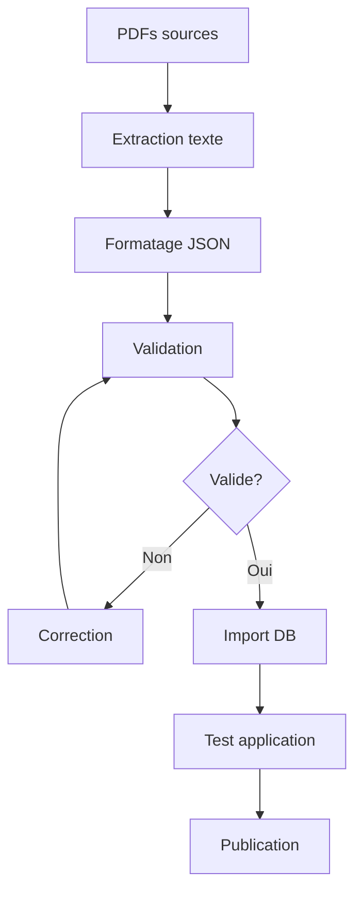

# 📚 Guide d'Import d'Exercices - Mathia

## 🎯 Vue d'ensemble

Ce guide vous explique comment intégrer des exercices de mathématiques dans votre application Mathia depuis des PDFs ou autres sources, sans dépendre de l'IA.

## ✅ Avantages de cette approche

- **Qualité garantie** : Exercices rédigés par des professionnels
- **Cohérence pédagogique** : Progression logique et adaptée
- **Pas de dépendance IA** : Fonctionnement autonome
- **Contrôle total** : Maîtrise du contenu pédagogique
- **Performance** : Pas de latence de génération

## 🛠️ Outils disponibles

### 1. Importateur PDF (`pdf_exercise_importer.py`)
Extrait automatiquement les exercices depuis des PDFs.

### 2. Formateur d'exercices (`exercise_formatter.py`)
Convertit et structure les exercices au format JSON.

### 3. Validateur d'exercices (`exercise_validator.py`)
Vérifie la qualité et la cohérence des exercices.

### 4. Interface d'administration
API REST pour gérer les exercices via l'interface web.

## 📋 Format des exercices

### Structure JSON requise

```json
{
  "type": "qcm|libre|vrai-faux|calcul",
  "body": "Énoncé de l'exercice",
  "answer": "Réponse correcte",
  "explanation": "Explication de la solution (optionnel)",
  "difficulty": "facile|moyen|difficile",
  "tags": ["tag1", "tag2"],
  "options": {
    "A": "Option A",
    "B": "Option B", 
    "C": "Option C",
    "D": "Option D"
  }
}
```

### Types d'exercices supportés

1. **QCM** : Questions à choix multiples
2. **Libre** : Réponse libre
3. **Vrai-Faux** : Questions de vérité
4. **Calcul** : Exercices de calcul

## 🚀 Utilisation

### Méthode 1 : Import depuis PDF

```bash
# Installation des dépendances
pip install PyPDF2 pdfplumber psycopg2-binary

# Import automatique (expérimental)
python scripts/pdf_exercise_importer.py --pdf exercices.pdf --course-id 1 --auto-format

# Import manuel (recommandé)
python scripts/pdf_exercise_importer.py --pdf exercices.pdf --course-id 1
```

### Méthode 2 : Formatage manuel

```bash
# Mode interactif
python scripts/exercise_formatter.py

# Parser depuis un fichier texte
python scripts/exercise_formatter.py --input exercices.txt --output exercices.json
```

### Méthode 3 : Validation et correction

```bash
# Valider un fichier d'exercices
python scripts/exercise_validator.py --file exercices.json

# Valider et corriger automatiquement
python scripts/exercise_validator.py --file exercices.json --fix --output exercices_corriges.json

# Générer un rapport détaillé
python scripts/exercise_validator.py --file exercices.json --report rapport.txt
```

### Méthode 4 : Via l'interface d'administration

1. **Upload de fichier** : `POST /api/admin/exercises/import`
2. **Création manuelle** : `POST /api/admin/exercises`
3. **Gestion** : Interface web d'administration

## 📝 Processus recommandé

### Étape 1 : Préparation
1. Collectez vos PDFs d'exercices
2. Organisez-les par niveau (6ème, 5ème, 4ème, 3ème)
3. Vérifiez la qualité du contenu

### Étape 2 : Extraction
```bash
# Extraire le texte des PDFs
python scripts/pdf_exercise_importer.py --pdf chapitre1.pdf --course-id 1
```

### Étape 3 : Formatage
```bash
# Formater les exercices extraits
python scripts/exercise_formatter.py --input exercices_bruts.txt --output exercices_formates.json
```

### Étape 4 : Validation
```bash
# Valider la qualité
python scripts/exercise_validator.py --file exercices_formates.json --fix
```

### Étape 5 : Import
```bash
# Importer dans la base de données
python scripts/import_exercises.py --file exercices_formates_fixed.json --course-id 1
```

## 🔧 Configuration

### Variables d'environnement requises

```env
DB_HOST=localhost
DB_PORT=5432
DB_NAME=mathia_db
DB_USER=postgres
DB_PASSWORD=votre_mot_de_passe
```

### Dépendances Python

```bash
pip install PyPDF2 pdfplumber psycopg2-binary python-dotenv
```

## 📊 Exemples concrets

### Exemple 1 : Exercice QCM

```json
{
  "type": "qcm",
  "body": "Quelle est la valeur de 2 + 3 ?",
  "options": {
    "A": "4",
    "B": "5",
    "C": "6", 
    "D": "7"
  },
  "answer": "B",
  "explanation": "2 + 3 = 5",
  "difficulty": "facile",
  "tags": ["addition", "arithmétique"]
}
```

### Exemple 2 : Exercice de calcul

```json
{
  "type": "calcul",
  "body": "Résoudre l'équation: x + 5 = 12",
  "answer": "x = 7",
  "explanation": "x + 5 = 12 donc x = 12 - 5 = 7",
  "difficulty": "moyen",
  "tags": ["équations", "algèbre"]
}
```

### Exemple 3 : Exercice Vrai-Faux

```json
{
  "type": "vrai-faux",
  "body": "La somme des angles d'un triangle est égale à 180°",
  "answer": "Vrai",
  "explanation": "C'est une propriété fondamentale des triangles",
  "difficulty": "facile",
  "tags": ["géométrie", "triangles"]
}
```

## 🎯 Bonnes pratiques

### 1. Qualité du contenu
- Vérifiez l'exactitude mathématique
- Assurez-vous de la clarté des énoncés
- Incluez des explications détaillées

### 2. Organisation
- Utilisez des tags pertinents
- Respectez les niveaux de difficulté
- Groupez par chapitres/thèmes

### 3. Validation
- Validez toujours avant l'import
- Testez quelques exercices manuellement
- Vérifiez la cohérence des réponses

### 4. Maintenance
- Gardez une trace des sources
- Documentez les modifications
- Sauvegardez régulièrement

## 🚨 Dépannage

### Problèmes courants

1. **Erreur de connexion DB**
   ```bash
   # Vérifier les variables d'environnement
   echo $DB_HOST $DB_NAME
   ```

2. **PDF illisible**
   ```bash
   # Essayer avec un autre outil
   python scripts/exercise_formatter.py --input texte_manuel.txt
   ```

3. **Format JSON invalide**
   ```bash
   # Valider le JSON
   python -m json.tool exercices.json
   ```

4. **Exercices dupliqués**
   ```bash
   # Vérifier les doublons
   python scripts/exercise_validator.py --file exercices.json
   ```

## 📈 Statistiques et monitoring

### API d'administration

```bash
# Statistiques des exercices
GET /api/admin/exercises/stats

# Liste des exercices
GET /api/admin/exercises?page=1&limit=20

# Recherche
GET /api/admin/exercises?search=équations&difficulty=moyen
```

### Métriques importantes

- Nombre total d'exercices par niveau
- Répartition par type d'exercice
- Taux d'exercices avec explications
- Qualité moyenne (longueur, clarté)

## 🔄 Workflow complet



## 📞 Support

Pour toute question ou problème :

1. Consultez les logs d'erreur
2. Vérifiez la configuration
3. Testez avec des exemples simples
4. Contactez l'équipe de développement

---

**🎉 Félicitations !** Vous disposez maintenant d'un système complet pour intégrer des exercices de qualité dans votre application Mathia, sans dépendre de l'IA.

